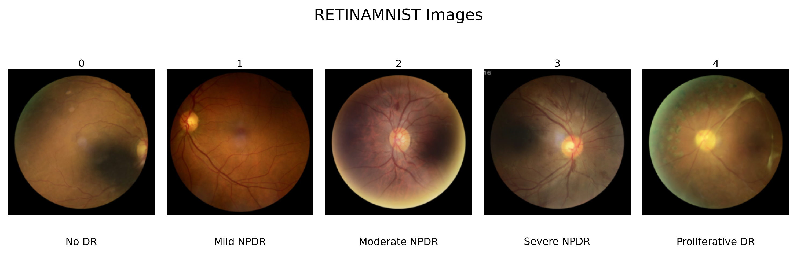
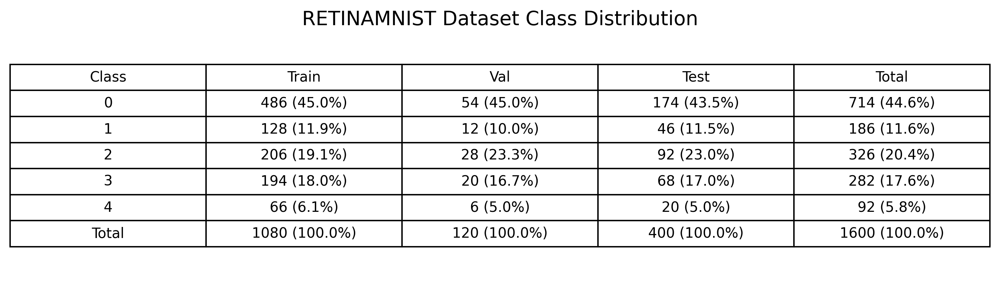
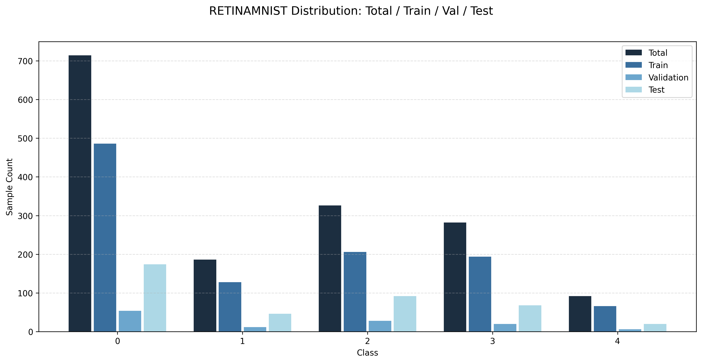
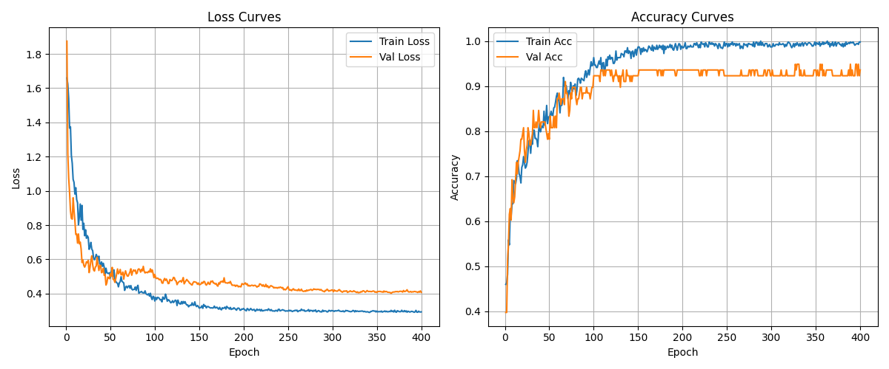
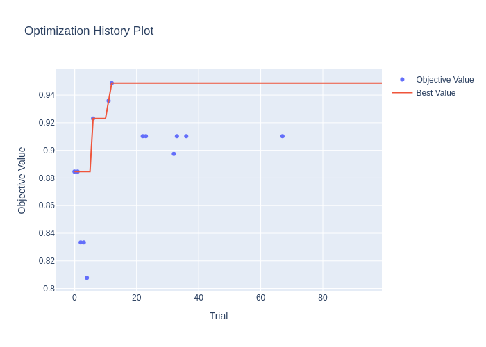
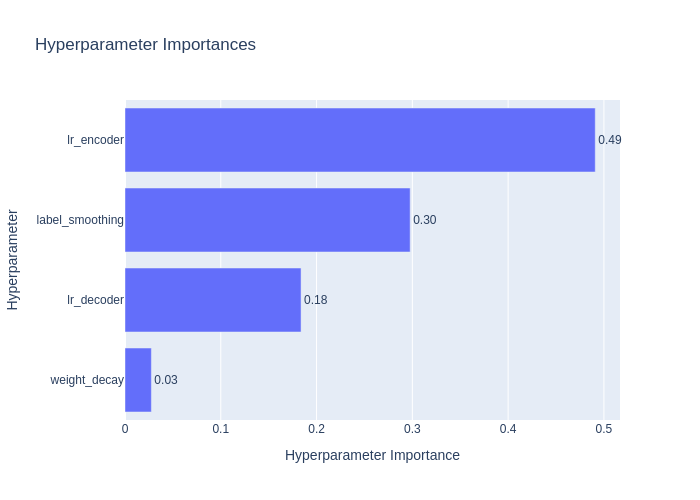

# AI-Image-Classification | Create MedMNIST+ dataset plots based on: https://zenodo.org/records/10519652 and run three experiments based on the code of: https://github.com/sdoerrich97/rethinking-model-prototyping-MedMNISTPlus
 
This repository plots the MedMNIST+ dataset and runs three experiments to recreate and improve sota medical image classifications
 
 

# 🔑 Key Contributions 
The key contributions of this github is to provide code for three experiment based on the work of https://github.com/sdoerrich97/rethinking-model-prototyping-MedMNISTPlus.
- First the fine-tuning pipeline is rerun with the possibility to run multiple models, datasets, seeds in one run and to log the training progress in .txt files.
- Second the fine-tuning pipeline is adjusted so the training is iteration-based, uses one learning rate for the encoder and one for the decoder and appllies scaling.
- Third the fine-tuning pipeline is improved with data augmentation with random resizing, horizontal and vertical flipping, and affine, oversampling of underrepresented classes, automated hyperparameter tuning with optuna, warm up and cosine annealing, speed up of training with autocast, and training tracking and plotting of train_loss, val_loss, train_acc, and val_acc for training evaluation.

# 📁 Dataset Charts
This Code repository takes the MedMNIST+ dataset and plots the Images with Classes and Class name, the Train, Val, Test, and Total Distribution as Table and Bar Chart

Exemplary RetinaMNIST Dataset Images 
 

Exemplary RetinaMNIST Dataset Total, Train, Val,Test Distribution Table
 

Exemplary RetinaMNIST Dataset Total, Train, Val,Test Distribution Bar Chart
 

# 🧪 Experiment 1 - Reproduce sota methods
First the fine-tuning pipeline is rerun with the possibility to run multiple models, datasets, seeds in one run and to log the training progress in .txt files.

# 🧪 Experiment 2 - Reproduce sota methods
Second the fine-tuning pipeline is adjusted so the training is iteration-based, uses one learning rate for the encoder and one for the decoder and appllies scaling.

# 🧪 Experiment 3 - Improve sota methods
Third the fine-tuning pipeline is improved with data augmentation with random resizing, horizontal and vertical flipping, and affine, oversampling of underrepresented classes, automated hyperparameter tuning with optuna, warm up and cosine annealing, speed up of training with autocast, and training tracking and plotting of train_loss, val_loss, train_acc, and val_acc for training evaluation

  

  
  

